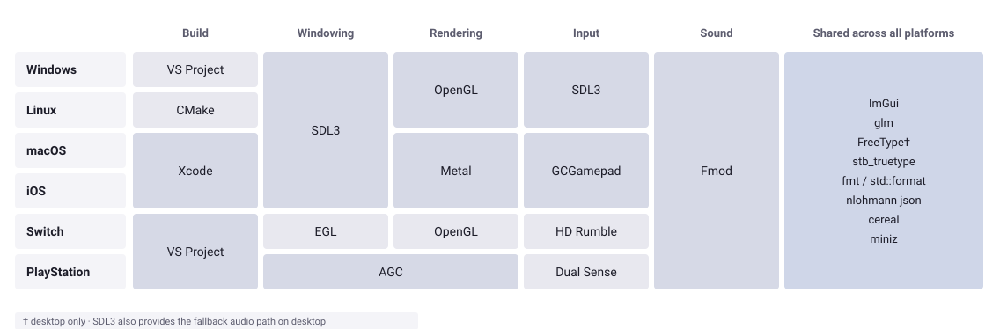

---
# Architecture & Design

xs is an e**X**tra **S**mall game engine, aimed at quick iterations on small games. The core is C++, games are Wren. It is mainly built around how its authors make games: plenty of code and some procedural generation.

*This document goes over key decisions and their impact, and it covers usage. It is not a Technical Design Document, API reference or Tutorial.*

## Philosophy

Everything follows from these key points.

**Code-first.** Code is a creative expression and in xs code is the main way to create games. All game logic is written in a scripting language. The engine's UI is minimal and mostly used for debugging, tweaking and inspection.

**Rapid ideation.** Scripts should hot-reload without restarting and new projects should take minutes to get off the ground. The UI should expose game parameters at runtime for live editing.

**No features, no bugs.** Every line of API is a promise that needs to be kept for the lifetime of the project. xs actively tries to maintain a minimal feature set, but one that works reliably at all times.

**Tiny, but shippable.** More than experiments, a game should be shippable on most platforms with xs.

**Minimal cognitive load.** xs aims to reduce the number of choices that a game developer would need to make at any given time.

## Architecture Decisions

All architectural decisions stem from the key points above.

**Games are script.** *Why:* rebuilding C++ can kill flow, while a VM reload is immediate. Creating a new folder with a script file takes seconds, setting up a multi-platform C++ project does not.
*Costs:* a speed ceiling on gameplay (~10x slower), and debugging that crosses a language boundary.

**C++ as implementation language.**
All game-related platforms and APIs are primarily C/C++. This does not imply we have to use all of C++.

### C++ API

**Namespaces with free functions**
`xs::render`, `xs::fileio`, `xs::audio`, each with `initialize`, `shutdown`, `update` and a flat API surface. *Instead of:* classes of systems and subsystems with singletons, injection, service locator and similar s**t. *Why:* minimal cognitive load, allows interfaces to be split across files. There is a single instance of xs anyhow. Modeled after libraries like ImGui. *Costs:* there is a single instance of xs. Implicit and non-deterministic static initialization.

**Parameters and return values are primitives and opaque handles.**
Images, sprites, shapes, fonts are integer handles. Colors are numbers. Vectors are Wren types. *Instead of:* exposing engine objects to the rest of the engine and to script. *Why:* hides the entire implementation, so the core can be implemented completely differently per platform. Wren is dynamically typed anyhow. Minimal headers included. *Costs:* type errors show up as bad handles rather than at compile time.

**Lowercase throughout.** Following the C++ standard library coding style everything is lowercase. Files, folders, commit messages included.

**Examples**

<table>

<tr>
  <th>device.hpp</th>
  <th>render.hpp</th>
  <th>data.hpp</th>
</tr>

<tr>
<td>

```cpp
namespace xs::device
{
  void initialize();
  void shutdown();
  void begin_frame();
  void end_frame();
  void poll_events();
  void start_frame();
  bool should_close();
  int get_width();
  int get_height();
}


```

</td>
<td>

```cpp
namespace xs::render
{	
  void initialize();
  void shutdown();
  void render();
  int load_image(
    const std::string& image_file);
  int create_sprite(
    int image_id,
    double /* more params */);
  void sprite(
    int sprite_id,
    double x,
    double y,		
    double z,
    /* more params */);
}
```

</td>


<td>

```cpp
namespace xs::data
{
  enum class type
  { none = 1, project = 2,
    game = 4, save = 5 };

  void initialize();
  void shutdown();
  void inspect();
  double get_number(
    const std::string& name,
    type type,
    double default_value = 0.0);
  void set_number(
    const std::string& name,
    double value, type tp);
}
```

</td>

</tr>
</table>

**Platforms and backends are resolved at compile-time.**
No virtual backend interfaces. Each implementation goes in a different `.cpp` file. *Instead of:* an abstract backend interface, implementation picked at runtime. *Why:* a virtual interface turns a single build-time question into a million runtime ones. Working on one platform does not interfere with another one. *Costs:* no easy runtime backend switching.


<table>

<tr>
  <td><b>Header</b></td>
  <td>device.hpp</td>
  <td>render.hpp</td>
  <td>data.hpp</td>
</tr>

<tr>
  <td>
  <b>Implementation</b>
  </td>
  <td>
    device.cpp - all platforms<br>
    +<br>
    device_pc.cpp - pc<br>
    device_apple.cpp - iOS, macOS<br>
    device_nx - switch<br>
  </td>
  <td>
    renderer.cpp - all platforms<br>
    +<br>  
    renderer_opengl.cpp - OpenGL<br>
    renderer_metal.cpp - Metal<br>
    <br>
  </td>
<td>
  data.cpp - all platforms<br><br><br><br><br>
</td>
</tr>
</table>


### Wren API

**Scripting in (type-checked) Wren.**
*Why:* class-based, looks like C# (and C++). Faster and smaller than Lua with a VM small enough to comprehend (and modify). Milliseconds to compile a whole game to bytecode. Check the *Appendix*. *Costs:* smaller ecosystem than Lua. Wren is (effectively) unmaintained, so xs has a fork with type extensions.

**The xs library is not in core.** Entity-component, all components, containers, geometry helpers, all in script. Single entry point is through a minimal *Game* class with three methods. *Why:* keeps the core tiny and stateless (oblivious of gameplay). That is what makes live reload work.
*Costs:* gameplay runs at script speed, which caps entity counts.

**Examples**

<table>

<tr>
  <th>core.wren</th>
  <th>ec.wren</th>
  <th>game.wren</th>
</tr>

<tr>
<td>

```wren
// Maps to the C++ API
class Render {
  foreign static loadImage(
    path: String) -> Num
  foreign static createSprite(
    imageId: Num,
    x0: Num,
    y0: Num,
    x1: Num,
    y1: Num) -> Num
  foreign static sprite(
    spriteId: Num,
    x: Num,
    y: Num,
    /* more params */)
}
// Device, FileIO
// Audio the same way
```

</td>
<td>

```wren
// Entity and Component are
// fully implemented in Wren
class Component {
  initialize() {}
  finalize() {}
  update(dt: Num) {}
}
class Entity {
  add(component: Component)
    -> Component {}
  get(type) {}
  remove(type) {}
  // Init the EC system
  static initialize()
  // Update all the entities
  static update(dt: Num)
}

```

</td>
<td>

```wren
// Entry point to your game
class Game {
  // Called on start
  static initialize() {        
    var image = Render.loadImage(
      "[shared]/images/white.png")
    __sprite = Render.createSprite(
      image, 0, 0, 1, 1)
  }    
  // Called every "frame"
  static update(dt) {}
  // Called every "frame"
  static render() {
    Render.sprite(__sprite,
      0, 0, 0, 1, 0.0,
      0xffffffff, 0x00000000, 0)
  }
}
```

</td>
</tr>
</table>

---


### Content and Data

**Single (typed) registry for tuning, saves and engine config.**
`Data.getNumber`, `getColor`, `getBool`, variables synced per *type*. *Instead of:* prefabs, scriptable objects and scene files. *Why:* one mechanism, one UI. Anything read from `Data` is automatically live-editable. We can tweak a value from anywhere in the game. Cloud saves where the platform supports them. *Limitations:* one file per *type*.

```wren
// This will show up as a variable in the UI 
// in the game tab, in the *Player* section 
var playerHealth = Data.getNumber("Player.Health", Data.game)

// This variable will be saved and might be cloud uploaded
// on supported platforms
Data.setValue("Level", currentLevel)
```

**Files with wildcards.**
`[game]`, `[shared]`, `[save]`, `[user]`, resolved centrally by `fileio`.
*Instead of:* real paths, mode handled at each call site. *Why:* the same path has to resolve against a project folder in development and a packaged
`.xs` when shipped. Game code can be oblivious of platform and running mode.
*Costs:* they aren't real paths, so they can't be handed to a library doing its own file IO (FMOD is the friction here).

```wren
// Load an image on all platforms (resolves sandboxes and such)
// Load a file segment if running a packaged game
var tileSet = Render.loadImage("[game]/assets/tileset.png")

// Will save a string in document and cloud sync it
FileIO.save("[save]/progress.json", progress)
```

### File structure

The file structure aims to be simple as well, with most of the code in `code` and hpp and cpp files side by side. Console platform specific code is in separate non-public repos.

```
code/              engine core — portable C++17
  ...              most code files go here (all common headers and implementation files)
  opengl/          OpenGL backend
  sdl3/            SDL3 device, input, audio
platforms/         entry points for platform-specific code
  pc/              pc code
  linux/           linux code
  apple/           apple is macOS and iOS
  null/            empty implementations when gradually adding support
  nx/              [private submodule] NX implementation files
  prospero/        [private submodule] Prospero implementation files
external/          vendored dependencies
resources/modules/ Wren module library
samples/           examples, and the test suite
tools/             a set of Python tools (version stamp, dependency manager, packaging, icon generation)
```

### Project

A folder, a `project.json` and a main script make a minimal project. Assets sit alongside, and a `game.json` is written automatically for tuning data.

### Platforms and libraries



Six platforms, five varying concerns and a set of shared libraries. Each one carefully chosen for the role, but also subject to change.

### No API stability.

The API can change between versions. If there is a better way to achieve something, it gets a try. See **Versioning**.

### Versioning

**CalVer**, `YY.BUILD`, where build is the commit count for the year, generated into `code/version.hpp` at build time. Single source of version truth for the engine, the installer and the package format. **Not semver** — there's no version compatibility to promise.

### Running

The CLI is desktop only. Consoles have their own entry point in `platforms/` and never see these arguments.

```
xs run <path>            # project folder or .xs package, defaults to "."
xs package <in> [out]    # writes <folder-name>.xs when out is omitted
xs version               # gives the engine version
```

Three run modes, picked from the command line and never from config:

| Mode | Trigger | What runs |
| --- | --- | --- |
| development | `xs run <folder>` | everything, loose files from the folder |
| packaged | `xs run <file>.xs` | everything, content from the package |
| packaging | `xs package <in> [out]` | no window, no rendering — `log`, `fileio`, `data` and script configuration only |

The mode comes from the file extension, not a flag, so running a game is one word either way.

### Risks and future work

**Shipping** is still not tested and we are most likely overlooking something.

**The Wren fork.** We are now responsible for maintaining our fork of the language.

**Script-speed gameplay.** This might not fit all kinds of games well.

**Build drift.** Nothing checks that the different build systems stay in sync.


## Appendix

### The .xs package format

All game assets and code in one file, written and read via Cereal.

| Field | Type | Notes |
| --- | --- | --- |
| magic | `uint64` | `0x454E49474E455358` — reads as "XSENGINE" in a hex editor |
| version | `uint32` | `(year << 16) \| build`, taken from `version.hpp` |
| entries | array | one per packaged file |

Each entry carries `relative_path`, `uncompressed_size`, `data_offset`, `data_length` and `is_compressed`. The file data itself is not part of the entry header, so it can be loaded separately.

Paths keep their wildcard prefix — `[game]/images/tileset.png` Packaging walks `[game]` and `[shared]`. Dotfiles and hidden folders are skipped.

Text formats are compressed with zlib (via miniz). Binary formats are stored as-is, since they are already compressed:

| | Extensions |
| --- | --- |
| compressed | `.wren` `.frag` `.vert` `.glsl` `.comp` `.json` `.txt` `.xsanim` `.xssprite` `.xstiles` |
| stored | `.png` `.jpg` `.ttf` `.otf` `.wav` `.mp3` `.ogg` `.flac` `.bank` |

### Typed Wren

We extend Wren with an external type checker, making sure we catch type mismatch errors at build time.

```wren
class Vec2 {
  construct new(x : Num, y : Num) {
    _x = x
    _y = y
  }
  *(v: Num) -> Vec2 { Vec2.new(x * v, y * v) }
}
class Wren {
    add(a : Num, b : Num) -> Num { a + b }

    main() {
      var val : Num = 0           // val is of type number      
      val = Wren.add(val, 1)      // OK. We can add numbers
      var vec = Vec2.new(2, 3)    // OK. Vec2 is constructed with numbers
      vec = vec * 2               // OK. Vec2 can be multiplied

      val = "text"                // Error! The checker will flag this
      val = Wren.add(val, "text") // Error! The checker will flag this
      vec = vec * "text"          // Error! The checker will flag this
      val = vec * 2               // Error! The checker will flag this
    }
}
```

### VS Code Extension

As a code-first engine, we are bringing the tools into the VS Code IDE. Two extensions are needed for smooth development.
- An xs VS Code extension that takes care of running the current folder if it contains an xs project. xs will use the built-in debug console. Creation and inspection of .xs packaged games can be done via the extension.
- A Wren extension that does syntax highlighting and full IntelliSense with type checking.
