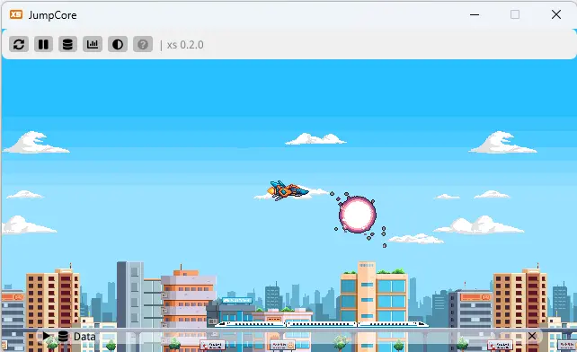

## Table of contents
{: .no_toc .text-delta }

1. TOC
{:toc}

# Getting Started
This a short introduction how to use *xs* to make extra small games. 

First, grab the latest version of *xs* from the itch.io page [here](https://xs-engine.itch.io/xs). If you are a member of the BUAS organization on GitHub, you can build it from source. The contents of the folder should look some thing like this.


The preferred way of running *xs* is from the command line (terminal) so the you can read the debug output. Open the your command line/terminal application and `cd` to the xs folder. Run the executable and you should get the following output in the command line. Even better, you can use Visual Studio Code and the built-in terminal.


On the first run *xs* will run the "hello" sample and save a user profile.


Great, *xs* is up and running.

## Creating a new project

Creating a new project in *xs* is quite simple. An *xs* project is just a folder. This folder need to have at least one `wren` file, that will contain your `Game` class, and a `project.json` file that points to it. You can check out the `hello` sample. The`Game` class needs to have three `static` methods in it. If any of those are missing, *xs* will not be able to run the game and might even crash.
- `initialize` -  Called as soon as all system have been created.
- `update` - Called once per tick (frame).
- `render` - Called once per tick, right after update.

The entire example `hello` is shown underneath.

```csharp
// This is just confirmation, remove this line as soon as you
// start making your game
System.print("Wren just got compiled to bytecode")

// The xs module is 
import "xs" for Render, Data

// The game class it the entry point to your game
class Game {
    // The init method is called when all system have been created.
    // You can initialize you game specific data here.
    static initialize() {        
        System.print("init")

        // The "__" means that __time is a static variable (belongs to the class)
        __time = 0

        // Variable that exists only in this function 
        var image = Render.loadImage("[games]/shared/images/FMOD_White.png")
        __sprite = Render.createSprite(image, 0, 0, 1, 1)
    }    

    // The update method is called once per tick. gameplay code goes here.
    static update(dt) {
        __time = __time + dt
    }

    // The render method is called once per tick, right after update.
    static render() {
        Render.setColor(0xFFFFFFFF)
        Render.shapeText("xs", -100, 100, 20)
        Render.shapeText("Made with love at Games@BUas", -100, -50, 1)
        Render.setColor(0xFFFFFFFF)
        Render.shapeText("Time: %(__time)", -300, -160, 1)

        Render.sprite(__sprite, 180, -152, 0.16, 0.0, 0xFFFFFFFF, 0x00000000, 0)
    }
}
```

Next just put your awesome art and code in the folder and you have yourself a game.

## Setting up the environment

Wren is lovely modern scripting language and there are handful of Visual Studio Code extensions to make working with it nicer.

- If you don't have Visual Studio Code installed, you can download the latest version [here](https://www.google.com/url?sa=t&rct=j&q=&esrc=s&source=web&cd=&cad=rja&uact=8&ved=2ahUKEwjJ_Pnx9Y_7AhXGjKQKHdtACsEQFnoECBYQAQ&url=https%3A%2F%2Fcode.visualstudio.com%2F&usg=AOvVaw15O90sm1ios8AUpw56hCml)
- The *Wren* [extension](https://marketplace.visualstudio.com/items?itemName=nelarius.vscode-wren) in VS Code will give you syntax highlighting 
- The *Wren Language Provider* [extension](https://marketplace.visualstudio.com/items?itemName=sponge.wren-language-provider) in VS Code will give you basic code completion

*xs* can be instructed (from the `system.json`) to run on top of other windows. This can be useful when developing or debugging with it. Running *xs* from the built-in terminal in VS code will give a "single window"-like experience.


## UI

While the main interaction with *xs* with code, there is some minimal UI to help you build games more efficiently. Moving your mouse to the upper third of the screen will bring up the toolbar. 



The toolbar in xs has the following functionality:

&nbsp;&nbsp; &nbsp;&nbsp; Reload the current game. *Will not reload image assets.*

&nbsp;&nbsp; &nbsp;&nbsp; Pause the game, if running.

&nbsp;&nbsp; &nbsp;&nbsp; Play the game, if paused.

&nbsp;&nbsp; &nbsp;&nbsp; Advanced the game one frame forward, if paused.

&nbsp;&nbsp; &nbsp;&nbsp; Open and close the Data window. More information in the Data section of the documentation.

&nbsp;&nbsp; &nbsp;&nbsp; Open and closes the Profiler window.

&nbsp;&nbsp; &nbsp;&nbsp; Cycle through the themes.

&nbsp;&nbsp; &nbsp;&nbsp; After a successful build a popup will appear briefly to confirm you amazing programming skills.

&nbsp;&nbsp; &nbsp;&nbsp; Upon encountering an error, *xs* will stop execution and will show a popup. The error will also be provided in the command line window. In VS code and you can also click error to get to the error line.

At the bottom of the screen you can see some stats and the version of *xs* the you are running.

## Paths

Paths in *xs* are relative and should start with one of the wildcards described in the *File* section of this documentation. For example you can use the `[game]` wildcard to access asset files in your game.

`var image = Render.loadImage("[game]/images/cat.png")`

## Supported assets

xs supports `.png` images and a variety of sound files, with `.flac` being the preferred format.

## Wren modules

A module in *wren* is usually another `.*wren` file that you can `import` into your code. Refer to the *wren* [manual](https://wren.io/modularity.html) for more information. *xs* ships with a few modules that let you interact with the engine and makes programming a bit easier.

- `xs` - gives you access to the core API of *xs* and is covered in the main part of the documentation.
- `xs_math` - has a handful of tools for 2d vector math, colors and bit operations
- `xs_ec` - offers a simple entity-components framework
- `xs_components` - has some useful components to help get started and demonstrate the use of the EC framework

The *hello* example start with importing such functionality.

`import "xs" for Render, Data`

These modules are located in the `games/shared/modules/` folder, so feel free explore their contents. Other modules come with the language itself and you are read more about them on the [wren documentation site](https://wren.io/modules/)
 - Core classes (numbers, lists and so on). These are automatically imported for you
 - `random` - gives access to the Random class used to generate random numbers
 - `meta` - gives self-inspection capability to your scripts (excluded from *xs* at current)

Lastly, you can, and should, use modules to organize your code. These must be located within your game's folder (and sub folders). When importing modules *xs* we omits the `.wren` extension.

### Circular dependencies

It's not uncommon for two, or more, modules to need functionality defined in the other module. Two modules importing one another will result in circular dependencies, with an and less than helpful error message. The solution is simple. Just put the import directive at the very end of both of the modules.
