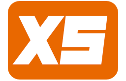

# An extra small game engine, lovingly made at Breda University of Applied Sciences 

**xs** an educational game engine, made with the goal of being the smallest game making tool possible.
It can also be a tool to teach introduction to programming for game developers, who might not necessarily be programmers.
- xs uses the [Wren](https://wren.io/) scripting language
- xs has minimal user interface
- xs uses 2D rendering and is best suited for pixel-perfect sprite graphics
- xs has basic audio support (using Fmod) for playing sound effects and background music
- xs can be built for PC, macOS, iOS, Nintendo Switch, and PlayStation 5

{: .warning }
> xs is in a very early alpha (and  open for contribution from anyone at games@buas)
> Features might be missing or not be stable.

## Running an example
Download the [latest](https://xs-engine.itch.io/xs) and run the file _xs.exe_. Next step is to check out the getting started setion.