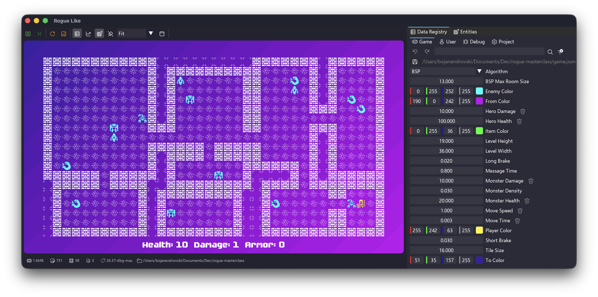

xs is a tiny 2D game engine: a code-first tool for rapid iteration with a focus on procedural generation.

## Highlights
- Gameplay in Wren; engine in C++
- Made for PC, Linux, macOS, iOS, Nintendo Switch, and Sony PlayStation 5
- Pixel-perfect 2D sprite rendering
- Shape rendering
- Minimal UI
- Basic audio
- Optional FMOD integration[^fmod]

## Documentation
Find setup guides, examples, API references, and contribution info on the docs site: https://bredauniversitygames.github.io/xs/

[^fmod]: FMOD is a commercial product that needs a separate license.

